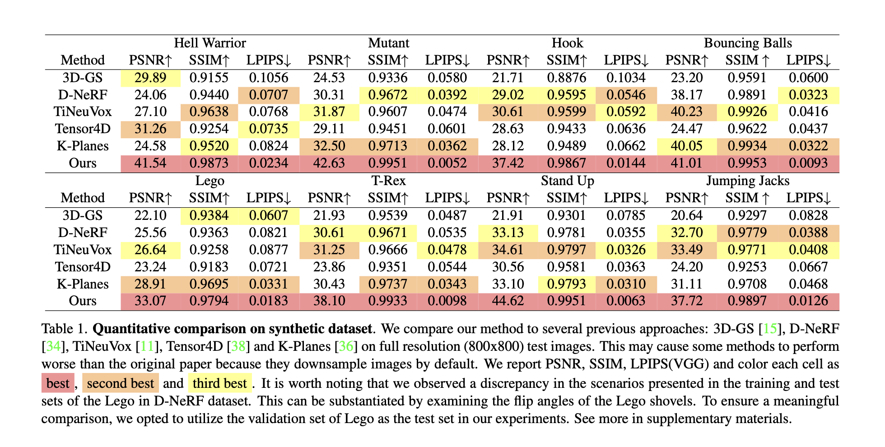

# Deal with cyclic graph

residual shortcut / recurrent

# Dilations

# Prune

# Nice Chart

# Paper

+ Cross functions opt - only possible from a top down view
    - API design perspective
      - OpenBLAS [FOR LOOP for Matrix Multiplication](https://github.com/OpenMathLib/OpenBLAS/issues/1636)
      - ONNX API design

# deal with padding and stride

# Intermittent support
